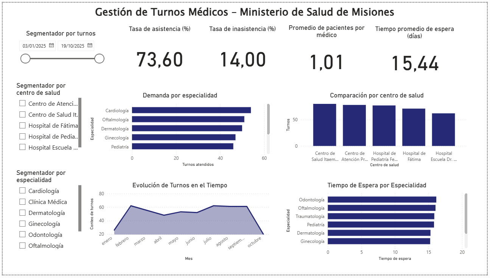
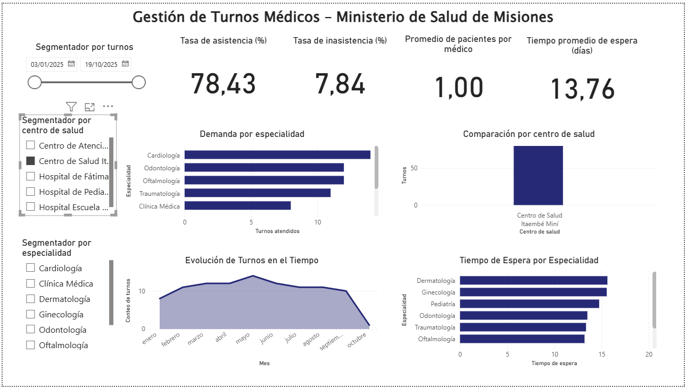
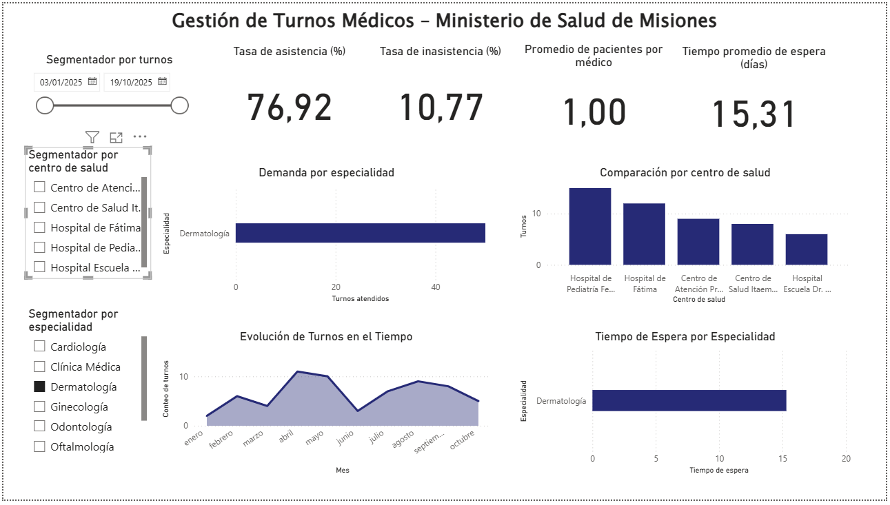

# 📊 Analítica de Gestión de Turnos Médicos – Misiones

Este proyecto analiza la demanda, asistencia y gestión de turnos médicos en hospitales y centros de salud de la provincia de Misiones con el objetivo de identificar oportunidades de mejora en la planificación de recursos y en la atención al paciente.

---

## Objetivos del análisis

- Medir la asistencia e inasistencia a turnos médicos
- Evaluar la demanda por especialidad y centro de salud
- Analizar el tiempo de espera para consultas
- Identificar tendencias mensuales y disponibilidad de servicios

---

## 📈 Visualizaciones

### Vista general del sistema de turnos
📌 KPIs: asistencia, inasistencia, tiempo de espera

### Segmentación por centro de salud

### Segmentación por especialidad

*Las visualizaciones permiten filtrar por hospital y especialidad para un análisis más detallado.*

---

## Tecnologías utilizadas

- **Power BI**
- **DAX**
- **Modelado de datos**
- **ETL con PowerQuery**

---

## 📌 Autora

**Guadalupe Esteche**  
Analista de Datos Jr • Misiones, Argentina  
LinkedIn: www.linkedin.com/in/estecheguada  

---

> 📍 Proyecto académico orientado a análisis de datos reales para mejora de servicios de salud pública
